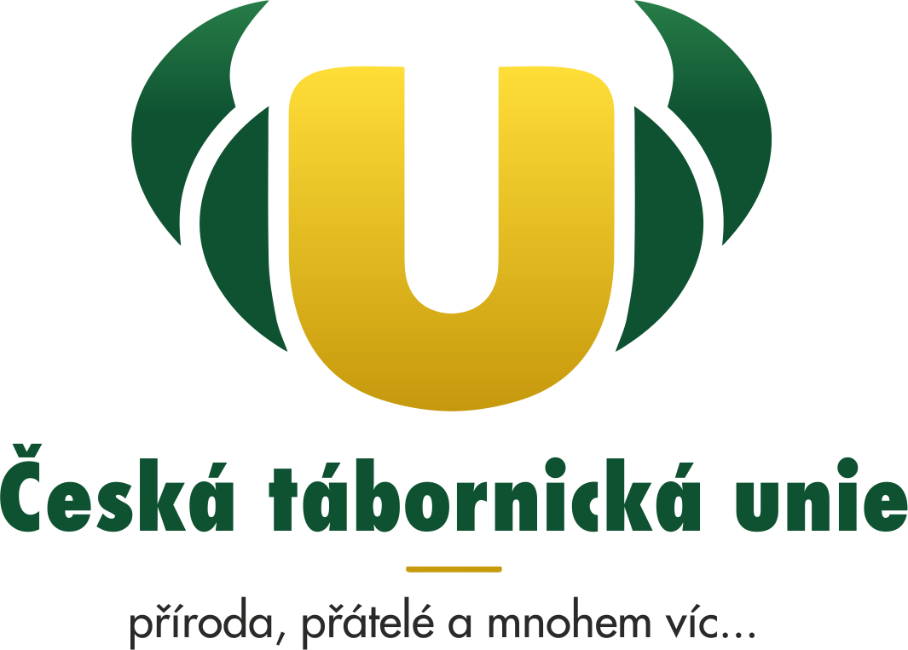
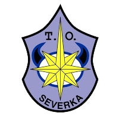

# Repozitář pro školení táborových vedoucí organizace T. O. Severka
Toto dílo je večené

## Aktuální soubory
- [Lidé, pedagogika a motivace](pedagogika/pedagogika.pdf)

## Plánovaná téma pro další roky
### __Komunikace__
- Jak jednat v krizové situaci

### __Psychologie a děti__
- Práce na nočních hrách, se strachy dětí
- Síla zážitku, zajištění kvalitního zážitku
- Fyzické postoje a význam
- Rizikové chování a poruchy příjmu potravy u dětí
- Specifické poruchy (učení, čtení, apod.)
- Sexualita v dětském věku

### __Vedoucí a práce v kolektivu__
- Efektivní team leading
- Vedení dětských oddílů